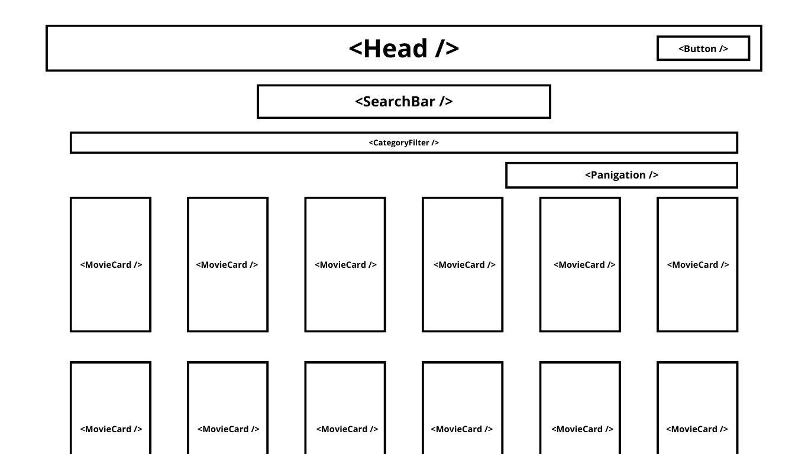
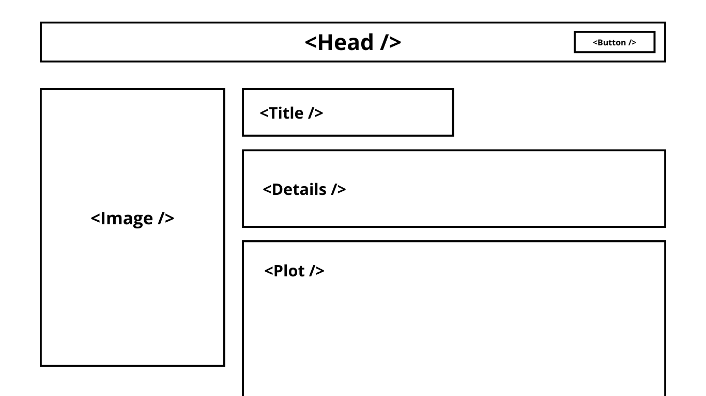

# Corso SSATI React e Typescript

Esercitazione in React con [Next.js](https://nextjs.org/)

## Introduzione

Qui potrai mettere in pratica tutte le tue conoscenze ed esprimerti creativamente nella realizzazione di un catalogo web di film. Next.js è un framework per React che offre tutti gli strumenti necessari per realizzare qualsiasi tipo di sito web o web app. Utilizza al massimo tutte le sue funzionalità aiutandoti con la [documentazione](https://nextjs.org/docs).

## Tasks

- [ ] Creare un progetto con `npx create-next-app@latest`
- [ ] Configurare [OMDb API](https://www.omdbapi.com/) (è un database aperto di film con 1k richieste possibili al giorno) oppure il proprio servizio backend sviluppato nel modulo ASP.NET Core
- [ ] Scegli come scrivere la tua UI, puoi farlo utilizzando una libreria CSS di tuo gradimento, ne esistono tantissime, tra le più famose [Tailwind CSS](https://tailwindcss.com/) (se desideri puoi considerare anche tutte le librerie che usano Tailwind come [DaisyUI](https://daisyui.com/), [Preline](https://preline.co/), [Bootstrap](https://getbootstrap.com/) e [Bulma](https://bulma.io/), insomma c'è l'imbarazzo della scelta, ma se scrivi il tuo _stile manualmente_ sarà altrettanto gradito)
- [ ] Home Page
  - [ ] Costruire un layout come da [immagine](images/home.png).
  - [ ] Implementare la ricerca dei film e la visualizzazione di un film
  - [ ] Implementa la logica necessaria per la paginazione
- [ ] Poster Page
  - [ ] Costruire un layout come da [immagine](images/poster.png).
  - [ ] L'identificativo del film dovrà essere passato come parametri nell'URL, quindi poi letto e fatta la richiesta con l'id specifico
  - [ ] Visualizza i dati del film selezionato
- [ ] Backoffice Page
  - [ ] Se sei qui, stai accedendo alla sezione "avanzata", ben fatto! Qui potrai esercitarti a costruire un'applicazione web gestionale. Qui potrai usare solo il tuo applicativo backend con le operazioni CRUD necessarie
  - [ ] Realizza una pagina di Login (anche fittizia)
  - [ ] Come nel layout realizzato fino ad ora, ne crea uno in cui è possibile visualizzare, modificare e aggiungere nuovi dati al tuo catalogo di film.

## Home UI

## Poster UI
